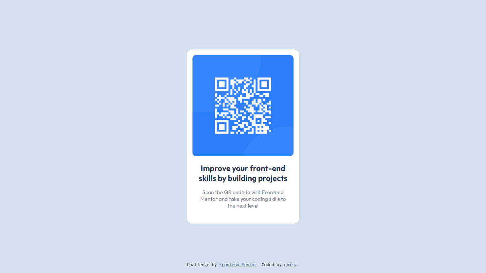

# Frontend Mentor - QR code component solution

This is a solution to the [QR code component challenge on Frontend Mentor](https://www.frontendmentor.io/challenges/qr-code-component-iux_sIO_H). Frontend Mentor challenges help you improve your coding skills by building realistic projects. 

## Table of contents

- [Overview](#overview)
  - [Screenshot](#screenshot)
  - [Links](#links)
- [My process](#my-process)
  - [Built with](#built-with)
  - [Useful resources](#useful-resources)
- [Author](#author)

## Overview

### Screenshot

### Links

- Solution URL: [https://github.com/qhxiv/qr-code-component-main.git](https://github.com/qhxiv/qr-code-component-main.git)
- Live Site URL: [Add live site URL here]

## My process

### Built with

- Semantic HTML5 markup
- CSS custom properties
- Flexbox

### Useful resources

- [F8 Official](https://fullstack.edu.vn/) - I have learned HTML & CSS from this site, but it have Vietnamese only.

## Author

- Frontend Mentor - [@qhxiv](https://www.frontendmentor.io/profile/qhxiv)
